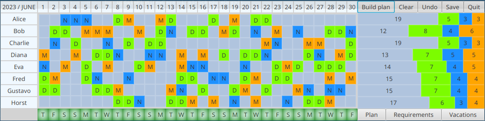

# shift-scheduler

A JavaFX application for automatic and manual shift scheduling. Supports three types of shifts (day, night, morning),
vacation planning and simple rules (maximal number of consecutive shifts and prohibited shift orderings).

## Using the program

* List employee names in a roster file in the `src/main/resources/rosters/` directory. Max number of employees is 30.
 
* Configure rules and current month in the `src/main/resources/settings` file.

* After starting the scheduler:
  * In the __Requirements__ view, adjust the number of employees needed for each shift on different days.
    Type __d__,__n__ or __m__ to increase the size of day, night or morning shift, or corresponding capital 
    letter to decrease it.
  
  * In the __Vacations__ view, assign vacation days for individual employees by typing __+__ and __-__
  
  * In the __Plan__ view, the *Build plan* button can be used to auto-generate schedule for the whole month
    or selected dates. Generated plan should respect the rules, staff requirements and vacations, and distribute
    the shifts between employees as equally as possible. 
    
  * Shifts can be manualy assigned by typing __d__,__n__,__m__  and canceled by __space__ or __-__.

  * Days whose state does not conform to the rules are marked red in the bottom panel, and the list of present
    errors is available in the tooltip.

  * Schedule may be saved to a JSON file and opened later.
